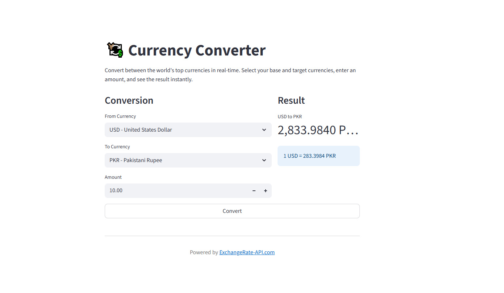

# 💱 Real-Time Currency Converter

Welcome to the Real-Time Currency Converter! This is a simple, user-friendly web application built with Python and Streamlit that allows you to quickly convert amounts between the world's top 20 most-traded currencies.




## ✨ Features

-   **Live Exchange Rates:** Get up-to-the-minute conversion rates from a reliable API.
    
-   **Top 20 Currencies:** Supports all major global currencies, from the US Dollar to the Pakistani Rupee.
    
-   **Simple Interface:** A clean and intuitive design makes currency conversion straightforward for everyone.
    
-   **Fast & Lightweight:** Built with Streamlit for a speedy and responsive user experience.
    

## 🚀 How to Get Started

Running this application on your local machine is easy. Just follow these simple steps:

### 1. Prerequisites

Make sure you have Python 3.7+ installed on your system.

### 2. Clone the Repository (or Download the Files)

Get a copy of the project files on your computer. This includes:

-   `currency_converter.py`
    

    

### 3. Install Dependencies

Open your terminal or command prompt, navigate to the project directory, and install the necessary Python libraries by running:

```
pip install streamlit request

```

### 4. Run the Application

Now, you're ready to launch the app! Run the following command in your terminal:

```
streamlit run currency.py

```

Your default web browser will automatically open a new tab with the Currency Converter application running. Enjoy!

<p align="center">Made with Streamlit and Python</p>